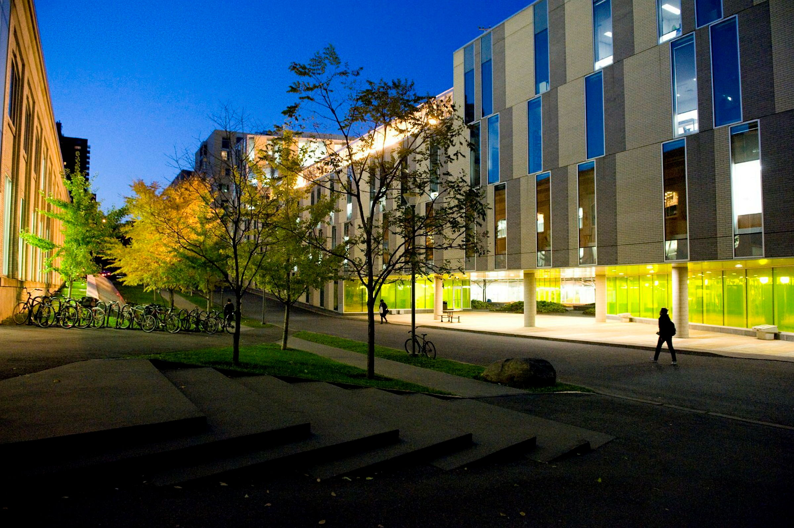

::: {.cara-contact-page}

::: {.cara-page-hero}

{fig-alt="Campus de l’UQAM"}

::: {.cara-page-hero-text}
::: {.cara-kicker}
UQAM · Département de mathématiques · Pavillon Président-Kennedy
:::

# Nous joindre

La Chaire Co-operators en analyse des risques actuariels est située au 5e étage du pavillon Président-Kennedy, dans le secteur des sciences de l’UQAM.
:::

:::

::: {.cara-contact-main}

::: {.cara-contact-section}

## Contacts à l’UQAM

::: {.cara-contact-grid}

::: {.cara-contact-card}
### Titulaire de la Chaire

::: {.cara-contact-name}
Prof. Jean-Philippe Boucher, Ph. D.
:::

::: {.cara-contact-detail}
**Local**  
PK-5720
:::

::: {.cara-contact-detail}
**Téléphone**  
[(514) 987-2078](tel:+15149872078)
:::

::: {.cara-contact-detail}
**Courriel**  
[boucher.jean-philippe@uqam.ca](mailto:boucher.jean-philippe@uqam.ca)
:::
:::

::: {.cara-contact-card}
### Directeur scientifique

::: {.cara-contact-name}
Prof. Mathieu Pigeon, Ph. D.
:::

::: {.cara-contact-detail}
**Local**  
PK-5625
:::

::: {.cara-contact-detail}
**Téléphone**  
[(514) 987-2807](tel:+15149872807)
:::

::: {.cara-contact-detail}
**Courriel**  
[pigeon.mathieu.2@uqam.ca](mailto:pigeon.mathieu.2@uqam.ca)
:::
:::

:::

:::

::: {.cara-contact-section}

## Adresses

::: {.cara-contact-grid}

::: {.cara-contact-card}
### Adresse postale

Chaire Co-operators en analyse des risques actuariels  
Département de mathématiques, UQAM  
C.P. 8888, Succursale Centre-ville  
PK-5151  
Montréal (Québec), Canada  
H3C 3P8
:::

::: {.cara-contact-card}
### Adresse civile

Chaire Co-operators en analyse des risques actuariels  
Département de mathématiques, UQAM  
201, avenue du Président-Kennedy  
PK-5151  
Montréal (Québec), Canada  
H2X 3Y7
:::

:::

:::

::: {.cara-contact-section}

## La Compagnie d’assurance générale Co-operators

::: {.cara-contact-grid .cara-contact-grid-single}

::: {.cara-contact-card}
### Liaison académique

::: {.cara-contact-name}
Frédérick Guillot, M. Sc., AICA
:::

::: {.cara-contact-detail}
**Courriel**  
[guillot.frederick@cooperators.ca](mailto:guillot.frederick@cooperators.ca)
:::
:::

:::

:::

:::

:::