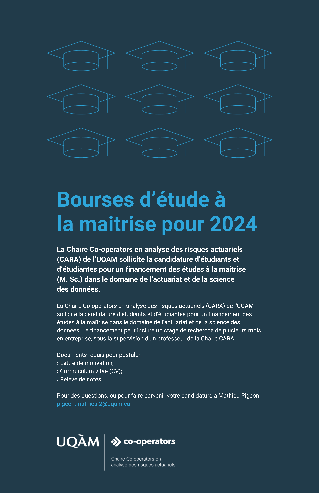

:::: {.columns}

::: {.column width="65%"}
La Chaire Co-operators en analyse des risques actuariels (CARA) de l’UQAM sollicite la candidature d’étudiants et d’étudiantes pour un financement des études à la maîtrise dans le domaine de l’actuariat et de la science des données. Le financement peut inclure un stage de recherche de plusieurs mois en entreprise, sous la supervision d’un professeur de la Chaire CARA.

Documents requis pour postuler:  
- Lettre de motivation;  
- Curriruculum vitae (CV);  
- Relevé de notes.

Pour des questions, ou pour faire parvenir votre candidature à Mathieu Pigeon, pigeon.mathieu.2@uqam.ca
:::

::: {.column width="2%"}
<!-- empty column to create gap -->
:::

::: {.column width="30%"}

:::

::: {.column width="3%"}
<!-- empty column to create gap -->
:::

::::

