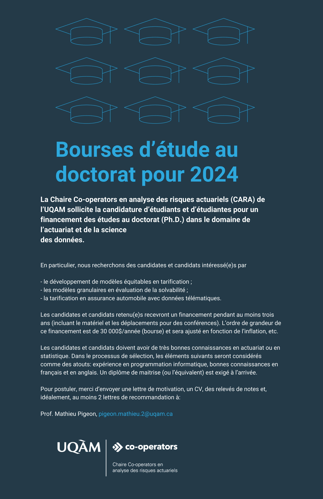

:::: {.columns}

::: {.column width="65%"}
La Chaire Co-operators en analyse des risques actuariels (CARA) est à la recherche d’étudiantes et d’étudiants de doctorat (Ph.D.) pour travailler sur des projets de recherche liés au développement de modèles en assurance de dommages. En particulier, nous recherchons des candidates et candidats intéressé(e)s par

- le développement de modèles équitables en tarification ;
- les modèles granulaires en évaluation de la solvabilité ;
- la tarification en assurance automobile avec données télématiques ;
- les modèles de contagion d’incendie.

Les candidates et candidats retenu(e)s recevront un financement pendant au moins trois ans (incluant le matériel et les déplacements pour des conférences). L’ordre de grandeur de ce financement est de 30 000$/année (bourse) et sera ajusté en fonction de l’inflation, etc.

Les candidates et candidats doivent avoir de très bonnes connaissances en actuariat ou en statistique. Dans le processus de sélection, les éléments suivants seront considérés comme des atouts: expérience en programmation informatique, bonnes connaissances en français et en anglais. Un diplôme de maitrise (ou l’équivalent) est exigé à l’arrivée.

Pour postuler, merci d’envoyer une lettre de motivation, un CV, des relevés de notes et, idéalement, au moins 2 lettres de recommandation à:

Prof. Mathieu Pigeon, pigeon.mathieu.2@uqam.ca

Pour des informations concernant cette demande, vous pouvez contacter Prof. Mathieu Pigeon.
:::

::: {.column width="2%"}
<!-- empty column to create gap -->
:::

::: {.column width="30%"}

:::

::: {.column width="3%"}
<!-- empty column to create gap -->
:::

::::

