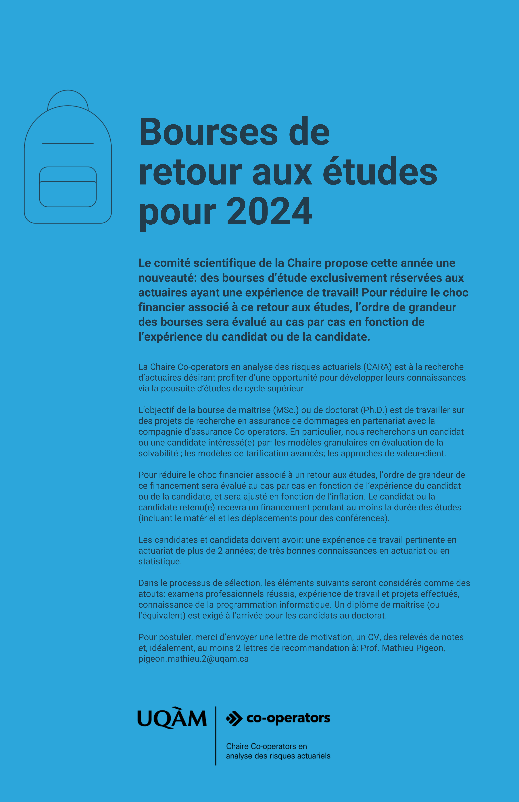

:::: {.columns}

::: {.column width="65%"}
La Chaire Co-operators en analyse des risques actuariels (CARA) est à la recherche d’actuaires désirant profiter d'une opportunité pour développer leurs connaissances via la pousuite d’études de cycle supérieur.

L’objectif de la bourse de maitrise (MSc.) ou de doctorat (Ph.D.) est de travailler sur des projets de recherche en assurance de dommages en partenariat avec la compagnie d’assurance Co-operators. En particulier, nous recherchons un candidat ou une candidate intéressé(e) par:  

- les modèles granulaires en évaluation de la solvabilité ; 
- les modèles de tarification avancés ;
- les approches de valeur-client.

Pour réduire le choc financier associé à un retour aux études, l'ordre de grandeur de ce financement sera évalué au cas par cas en fonction de l’expérience du candidat ou de la candidate, et sera ajusté en fonction de l'inflation.  Le candidat ou la candidate retenu(e) recevra un financement pendant au moins la durée des études (incluant le matériel et les déplacements pour des conférences). 

Les candidates et candidats doivent avoir: 
une expérience de travail pertinente en actuariat de plus de 2 années ; 
de très bonnes connaissances en actuariat ou en statistique. 

Dans le processus de sélection, les éléments suivants seront considérés comme des atouts: examens professionnels réussis, expérience de travail et projets effectués, connaissance de la programmation informatique. Un diplôme de maitrise (ou l’équivalent) est exigé à l’arrivée pour les candidats au doctorat.

Pour postuler, merci d’envoyer une lettre de motivation, un CV, des relevés de notes et, idéalement, au moins 2 lettres de recommandation à: 
Prof. Mathieu Pigeon, pigeon.mathieu.2@uqam.ca

Pour des informations concernant cette demande, vous pouvez contacter le Prof. Mathieu Pigeon à la même adresse.

:::

::: {.column width="2%"}
<!-- empty column to create gap -->
:::

::: {.column width="30%"}

:::

::: {.column width="3%"}
<!-- empty column to create gap -->
:::

::::

