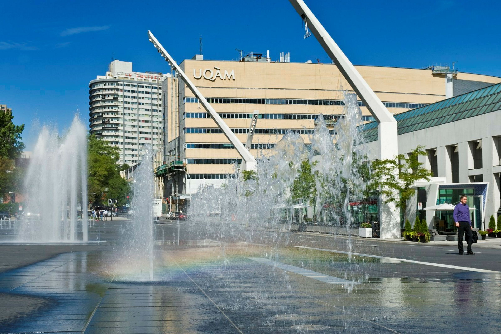
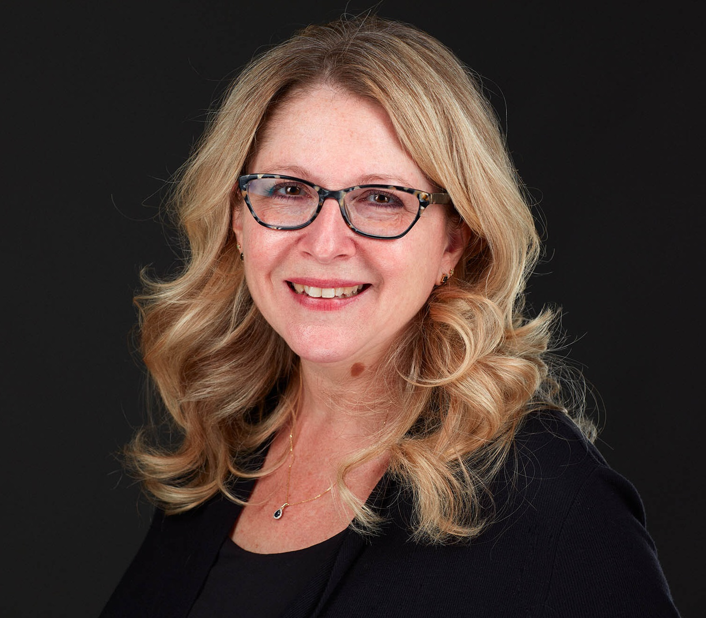

::: {.cara-committee-page}

::: {.cara-page-hero}

{fig-alt="Campus de l’UQAM"}

::: {.cara-page-hero-text}
::: {.cara-kicker}
Gouvernance · Chaire CARA
:::

# Comités de la Chaire

Les comités de la Chaire soutiennent le titulaire dans la planification, la gestion et l’orientation scientifique des activités de recherche, de formation et de rayonnement.
:::

:::

## Comité de direction

::: {.cara-section .cara-committee-section}

Tel que mentionné dans les instances et règlements de l’UQAM concernant les Chaires, le comité de direction a le mandat de soutenir et de conseiller le titulaire de la Chaire sur les aspects concernant la gestion de la Chaire. Ce comité est notamment responsable d’approuver la planification annuelle, les prévisions budgétaires et le rapport annuel d’activités.

::: {.cara-committee-grid}

::: {.cara-committee-member}

{.cara-committee-photo fig-alt="Jean-Philippe Boucher"}

::: {.cara-committee-info}
::: {.cara-committee-name}
[Pr. Jean-Philippe Boucher](https://ca.linkedin.com/in/jean-philippe-boucher-b12a313b), Ph. D.
:::

::: {.cara-committee-role}
Titulaire de la Chaire
:::

::: {.cara-committee-affiliation}
Professeur, Département de mathématiques, UQAM
:::
:::

:::

::: {.cara-committee-member}

{.cara-committee-photo fig-alt="Mathieu Pigeon"}

::: {.cara-committee-info}
::: {.cara-committee-name}
[Pr. Mathieu Pigeon](https://professeurs.uqam.ca/professeur/pigeon.mathieu.2/), Ph. D.
:::

::: {.cara-committee-role}
Directeur scientifique de la Chaire
:::

::: {.cara-committee-affiliation}
Professeur, Département de mathématiques, UQAM
:::
:::

:::

::: {.cara-committee-member}

{.cara-committee-photo fig-alt="Isabelle Marcotte"}

::: {.cara-committee-info}
::: {.cara-committee-name}
[Pr. Isabelle Marcotte](https://ca.linkedin.com/in/isabelle-marcotte-6279b816), Ph. D.
:::

::: {.cara-committee-role}
Vice-doyenne à la recherche
:::

::: {.cara-committee-affiliation}
Faculté des sciences, UQAM
:::
:::

:::

::: {.cara-committee-member}

{.cara-committee-photo fig-alt="Amélie Beauregard"}

::: {.cara-committee-info}
::: {.cara-committee-name}
[Amélie Beauregard](https://ca.linkedin.com/in/am%C3%A9lie-beauregard-026351116)
:::

::: {.cara-committee-role}
Vice-présidente, Tarification assurance des particuliers
:::

::: {.cara-committee-affiliation}
Co-operators
:::
:::

:::

::: {.cara-committee-member}

{.cara-committee-photo fig-alt="Hugues Laquerre"}

::: {.cara-committee-info}
::: {.cara-committee-name}
[Hugues Laquerre](https://ca.linkedin.com/in/hugues-laquerre-fcas-fica-a5473361), FCAS, FICA
:::

::: {.cara-committee-role}
Vice-président, Tarification agricole et commerciale
:::

::: {.cara-committee-affiliation}
Co-operators
:::
:::

:::

::: {.cara-committee-member}

{.cara-committee-photo fig-alt="Mathieu Giguère"}

::: {.cara-committee-info}
::: {.cara-committee-name}
[Mathieu Giguère](https://ca.linkedin.com/in/mathieu-gigu%C3%A8re-fcas-fcia-57755a8b), FCAS, FICA
:::

::: {.cara-committee-role}
Vice-président, Intelligence d’affaires
:::

::: {.cara-committee-affiliation}
Co-operators
:::
:::

:::

:::

:::

## Comité scientifique

::: {.cara-section .cara-committee-section}

Tel qu’indiqué dans les mêmes instances, le comité scientifique est chargé de conseiller le titulaire sur la programmation scientifique de la Chaire.

::: {.cara-committee-grid}

::: {.cara-committee-member}

{.cara-committee-photo fig-alt="Jean-Philippe Boucher"}

::: {.cara-committee-info}
::: {.cara-committee-name}
[Pr. Jean-Philippe Boucher](https://ca.linkedin.com/in/jean-philippe-boucher-b12a313b), Ph. D.
:::

::: {.cara-committee-role}
Titulaire de la Chaire
:::

::: {.cara-committee-affiliation}
Professeur, Département de mathématiques, UQAM
:::
:::

:::

::: {.cara-committee-member}

{.cara-committee-photo fig-alt="Mathieu Pigeon"}

::: {.cara-committee-info}
::: {.cara-committee-name}
[Pr. Mathieu Pigeon](https://professeurs.uqam.ca/professeur/pigeon.mathieu.2/), Ph. D.
:::

::: {.cara-committee-role}
Directeur scientifique de la Chaire
:::

::: {.cara-committee-affiliation}
Professeur, Département de mathématiques, UQAM
:::
:::

:::

::: {.cara-committee-member}

{.cara-committee-photo fig-alt="Frédérick Guillot"}

::: {.cara-committee-info}
::: {.cara-committee-name}
[Frédérick Guillot](https://www.linkedin.com/in/fr%C3%A9d%C3%A9rick-guillot-m-sc-acia-336a1237/), M. Sc., AICA
:::

::: {.cara-committee-role}
Principal Analytics and Science Strategist
:::

::: {.cara-committee-affiliation}
Co-operators
:::
:::

:::

::: {.cara-committee-member}

{.cara-committee-photo fig-alt="Étienne Larrivée-Hardy"}

::: {.cara-committee-info}
::: {.cara-committee-name}
[Étienne Larrivée-Hardy](https://ca.linkedin.com/in/etienne-larriv%C3%A9e-hardy-38a69351), M. Sc.
:::

::: {.cara-committee-role}
Senior Manager
:::

::: {.cara-committee-affiliation}
Co-operators
:::
:::

:::

:::

:::

:::
