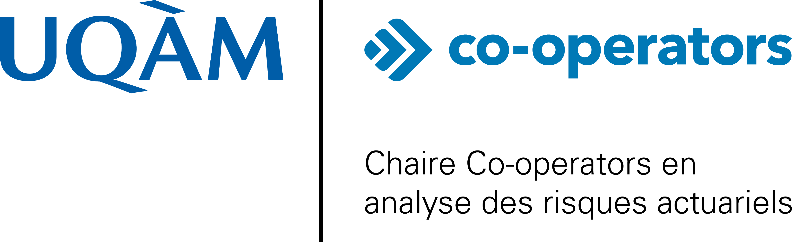

::: {.cara-page}

::: {.cara-top-grid}

::: {.cara-hero}

::: {.cara-kicker}
UQAM · Sciences actuarielles · Assurance de dommages
:::

::: {.cara-hero-logo-inline}
{fig-alt="Logo de la Chaire Co-operators en analyse des risques actuariels"}
:::

# Chaire Co-operators en analyse des risques actuariels

La Chaire Co-operators en analyse des risques actuariels contribue au développement de méthodes statistiques et actuarielles pour l’assurance générale, à l’étude empirique du comportement des assurés et à la formation de la relève en actuariat.

Fondée en 2018 et renouvelée jusqu’en 2029, la Chaire poursuit ses activités autour de projets de recherche appliquée, de collaborations avec le milieu industriel et d’activités scientifiques.

::: {.cara-actions}
[Équipe](equipe.html){.btn .btn-primary}
[Publications](publications.html){.btn .btn-outline-secondary}
:::

:::

::: {.cara-live-panel}

::: {.cara-live-section}
## Nouvelles récentes

::: {#home-news}
:::

[Voir toutes les nouvelles](nouvelles.html){.cara-more-link}
:::

:::

:::

::: {.cara-pillars}

::: {.cara-pillar}
### Recherche appliquée

Développement de modèles statistiques et actuariels pour mieux comprendre, mesurer et tarifer les risques en assurance générale.
:::

::: {.cara-pillar}
### Formation

Encadrement d’étudiant·e·s et diffusion de connaissances pour soutenir la relève en sciences actuarielles.
:::

::: {.cara-pillar}
### Partenariats

Collaboration avec le milieu professionnel afin de relier les avancées méthodologiques aux enjeux concrets de l’industrie.
:::

:::

:::