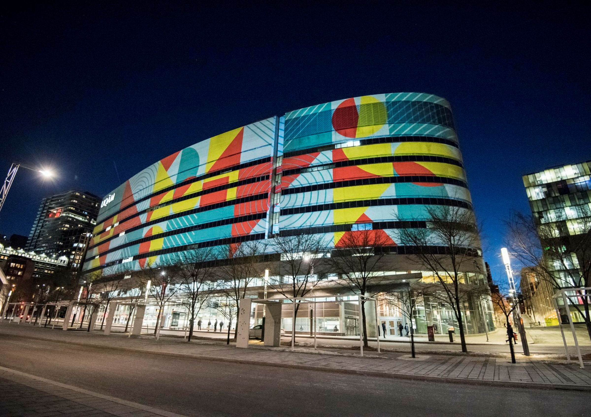

```{r echo = FALSE, results = "asis", message = FALSE, warning = FALSE}
library(dplyr)
library(lubridate)
library(stringr)

load("rda_files/Presentations.Rda")
load("rda_files/PresLocales.Rda")
```


::: {.cara-presentations-page}

::: {.cara-page-hero}

{fig-alt="Campus de l’UQAM"}

::: {.cara-page-hero-text}
::: {.cara-kicker}
Recherche · Communications scientifiques
:::

# Présentations scientifiques

Communications, conférences et présentations liées aux travaux de recherche de la Chaire Co-operators en analyse des risques actuariels.
:::

:::


::: {.cara-presentations-section}

## Présentations scientifiques

::: {.cara-presentation-list}

```{r echo = FALSE, results = "asis", message = FALSE, warning = FALSE}
template <- "
<div class='cara-presentation-item'>
  <div class='cara-presentation-title'>%s</div>
  <div class='cara-presentation-authors'>%s</div>
  <div class='cara-presentation-conference'><em>%s</em>, %s, %s</div>
</div>\n"

if (nrow(Presentations) > 0) {
  for (i in seq_len(nrow(Presentations))) {
    current <- Presentations[i, ]

    titre <- ifelse(is.na(current$Titre), "", current$Titre)
    presentateur <- ifelse(is.na(current$Presentateur), "", current$Presentateur)
    conference <- ifelse(is.na(current$Conference), "", current$Conference)
    ville <- ifelse(is.na(current$Ville2), "", current$Ville2)
    date <- ifelse(is.na(current$Date), "", current$Date)

    cat(sprintf(
      template,
      titre,
      presentateur,
      conference,
      ville,
      date
    ))
  }
}
```

:::

:::


::: {.cara-presentations-section}

## Présentations scientifiques locales

::: {.cara-presentation-list}

```{r echo = FALSE, results = "asis", message = FALSE, warning = FALSE}
template <- "
<div class='cara-presentation-item'>
  <div class='cara-presentation-title'>%s</div>
  <div class='cara-presentation-authors'>%s</div>
  <div class='cara-presentation-conference'><em>%s</em>, %s, %s</div>
</div>\n"

if (nrow(PresLocales) > 0) {
  for (i in seq_len(nrow(PresLocales))) {
    current <- PresLocales[i, ]

    titre <- ifelse(is.na(current$Titre), "", current$Titre)
    presentateur <- ifelse(is.na(current$Presentateur), "", current$Presentateur)
    conference <- ifelse(is.na(current$Conference), "", current$Conference)
    ville <- ifelse(is.na(current$Ville2), "", current$Ville2)
    date <- ifelse(is.na(current$Date), "", current$Date)

    cat(sprintf(
      template,
      titre,
      presentateur,
      conference,
      ville,
      date
    ))
  }
}
```

:::

:::

:::