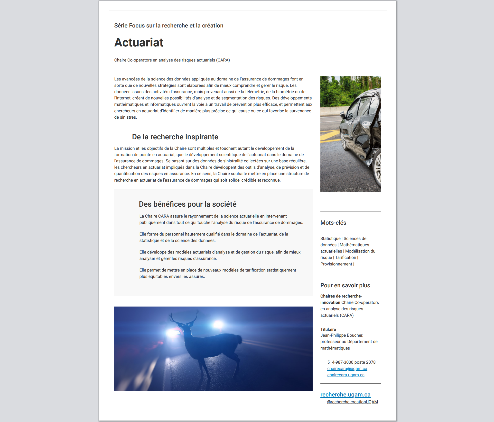

::: {.cara-mission-page}

::: {.cara-page-hero .cara-mission-hero}

{fig-alt="Inauguration de la Chaire en 2018"}

::: {.cara-page-hero-text}
::: {.cara-kicker}
Mission · Objectifs · Historique
:::

# Notre mission et nos objectifs

La Chaire Co-operators en analyse des risques actuariels soutient la recherche appliquée en assurance générale, la formation de la relève et le rayonnement de l’actuariat au Québec.
:::

:::

::: {.cara-section .cara-mission-section}

::: {.cara-section-header}
## Une mission triple

La Chaire articule ses activités autour de trois volets complémentaires.
:::

::: {.cara-mission-grid}

::: {.cara-mission-item}
### Formation

Former des étudiants, des étudiantes et de jeunes chercheurs aux cycles supérieurs, à la maîtrise et au doctorat, dans le domaine de l’actuariat, en leur offrant un encadrement de qualité et un environnement stimulant pour le développement de leurs compétences.
:::

::: {.cara-mission-item}
### Recherche

Développer des modèles statistiques et actuariels, et mettre à profit des données de sinistralité collectées régulièrement afin de concevoir des **outils novateurs de quantification des risques**: tarification, provisionnement et valeur à vie du client.
:::

::: {.cara-mission-item}
### Rayonnement

Faire reconnaître l’importance des actuaires dans la société québécoise en **prenant part activement aux débats publics** et en valorisant leur rôle central dans les enjeux liés à l’assurance générale.
:::

:::

:::

# Historique de la Chaire

::: {.cara-section .cara-history-section}

::: {.cara-history-card}

## Premier mandat — 2018 à 2024

La Chaire a été créée en **2018** grâce à une contribution de la coopérative d’assurance **Co-operators** dans le cadre de la campagne *100 millions d’idées* de l’UQAM, avec le professeur Jean-Philippe Boucher comme titulaire.

Ce premier mandat a permis d’implanter une structure de recherche solide en actuariat à l’UQAM et de réaliser plusieurs avancées marquantes.

- **Publications**: de nombreux articles publiés dans des revues reconnues, notamment *ASTIN Bulletin*, *North American Actuarial Journal*, *Variance*, *Insurance: Mathematics and Economics* et *Risks*.
- **Présentations scientifiques**: communications régulières dans des conférences majeures comme l’Actuarial Research Conference, la Société statistique du Canada, le *Joint Statistical Meeting* et le congrès *CAGNY*.
- **Formation de la relève**: plusieurs étudiants diplômés à la maîtrise et au doctorat, notamment Francis Duval, Roxane Turcotte, Marie Michaelides et Juan Sebastian Yánez.
- **Bourses**: attribution de bourses de maîtrise, de doctorat et de retour aux études afin de soutenir les chercheurs émergents.
- **Financement**: subventions de recherche obtenues du CRSNG et de l’AMF pour développer des modèles actuariels avancés et analyser les risques liés aux primes non acquises.
- **Distinctions étudiantes**: en 2022, Roxane Turcotte a reçu le deuxième prix du meilleur article dans la revue *Risks*, et Sébastien Jessup a remporté le prix de la meilleure présentation étudiante à la conférence de la Société statistique du Canada.

[Consulter les nouvelles](nouvelles.html){.cara-text-link}

:::

::: {.cara-history-card}

## Renouvellement — 2024 à 2029

En **2024**, la Chaire a été officiellement **renouvelée** pour un second mandat, confirmant son rôle stratégique en recherche actuarielle appliquée et en formation.

- **2023**: nomination du titulaire, le professeur J.-P. Boucher, au comité consultatif de l’AMF sur les véhicules automatisés et connectés.
- **2024**: Andre Orelien Chuisseu Tchuisseu a remporté le premier prix de présentation étudiante à l’Actuarial Research Conference.
- **Financement**: subvention de recherche obtenue du CRSNG pour la période 2024–2029.

La Chaire poursuit son appui à la relève à travers des **bourses de maîtrise et de doctorat**, ainsi que des **bourses de retour aux études** pour les actuaires en reconversion.

[Consulter les nouvelles](nouvelles.html){.cara-text-link}

:::

:::

# Fiche FOCUS — UQAM

::: {.cara-section .cara-focus-section}

::: {.cara-focus-grid}

::: {.cara-focus-image}
{fig-alt="Fiche FOCUS de l’UQAM sur la Chaire CARA"}
:::

::: {.cara-focus-text}

## Les données au service de la prévention

Les avancées de la science des données appliquée à l’assurance de dommages ouvrent de nouvelles perspectives:

- données issues de la télémétrie, de la biométrie et d’internet pour une meilleure segmentation des risques;
- outils mathématiques et informatiques pour un travail de prévention plus efficace;
- identification plus précise des causes et facteurs de sinistres.

[Voir la fiche complète sur le site de l’UQAM](https://recherche.uqam.ca/fiche_focus/actuariat/){.btn .btn-primary}

:::

:::

:::

:::